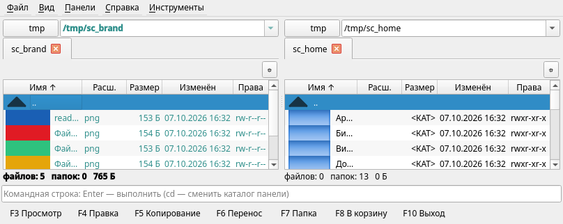

# Sphaera Commander

Двухпанельный файловый менеджер для Linux в духе Total Commander.
Python 3.10+ / Qt 6 (PySide6).



## Запуск

```sh
./run.sh
# или
.venv/bin/python -m sphaera_commander
```

Установка с нуля:

```sh
python3 -m venv .venv
.venv/bin/pip install -e .
.venv/bin/sphaera-commander
```

Ярлык в меню рабочего стола: `scripts/install-desktop.sh` (иконка + .desktop в `~/.local`).

Standalone-сборка без Python-окружения: `scripts/build_standalone.sh` → `dist/sphaera-commander/`.

## Возможности

- Две панели, переключение по **Tab**; чтение каталогов — в фоне, интерфейс не блокируется
- Навигация: Enter, Backspace — вверх, Alt+F1/F2 — диски и монтирования, Ctrl+U — поменять панели
- **F5** копирование, **F6** перенос, **F7** папка, **F8** удаление, **Shift+F6** переименование,
  **Ctrl+M** групповое переименование (шаблон + счётчик + предпросмотр)
- **F3** встроенный просмотр (текст с автоопределением кодировки utf-8/utf-16/cp1251,
  изображения, hex-обзор бинарных, поиск, Alt+↑/↓ — соседние файлы),
  **F4** встроенная правка (Ctrl+S, выбор кодировки при потере, защита несохранённых правок)
- **Alt+F5** запаковать (zip / tar.gz / tar.bz2 / tar.xz), **Alt+F6** распаковать
  (с защитой от zip-slip и пофайловым диалогом перезаписи)
- **Shift+F2** сравнение каталогов: различающиеся/отсутствующие файлы подсвечены синим
- Отметки: Insert, * — инверсия, +/− — по маске; контекстное меню в таблицах
- Операции в фоне: очередь (несколько операций подряд), прогресс, отмена текущей/всех,
  **диалог перезаписи как в TC** (размер/дата обоих файлов, «все перезаписать»/«все пропустить»)
- Автообновление панелей при изменении каталогов; сохранение состояния между запусками
- Командная строка: `/bin/sh`, история ↑/↓, `cd` меняет каталог активной панели

## Горячие клавиши

| Клавиша     | Действие                                 |
|-------------|------------------------------------------|
| Tab         | Переключить активную панель              |
| Enter       | Открыть каталог/файл (F3 — просмотр)     |
| Backspace   | На уровень вверх                         |
| Insert / * / + / − | Отметки (вставка/инверсия/маска)  |
| F3 / F4     | Просмотр / правка (встроенные)           |
| F5 / F6     | Копирование / перенос                    |
| F7 / F8     | Новая папка / удаление                   |
| Shift+F6    | Переименование                           |
| Ctrl+M      | Групповое переименование                 |
| Alt+F5 / F6 | Запаковать / распаковать                 |
| Shift+F2    | Сравнить каталоги                        |
| Alt+F1/F2   | Смена диска левой/правой панели          |
| Ctrl+F3/5/6 | Сортировка: имя / дата / размер          |
| Ctrl+H / Ctrl+R / Ctrl+U | Скрытые / обновить / поменять панели |
| Ctrl+Q      | Выход                                    |

## Тесты

```sh
.venv/bin/python -m unittest discover -s tests -v
```

Тесты движка не требуют дисплея; GUI-тесты идут на `QT_QPA_PLATFORM=offscreen`.

## Архитектура

- `fsmodel.py` — обход, сортировка, отметки/сравнение, Qt-модель
- `ops.py` — движок операций (план → исполнение, пофайловые конфликты через `ask_cb`)
  без Qt-виджетов; `run_in_thread` — обёртка над QThread (в воркер передаётся функция)
- `archives.py` — zip/tar запаковка и распаковка с защитой путей
- `viewer.py` — просмотр/правка: кодировки, hex, изображения
- `rename_tool.py` — шаблоны группового переименования
- `panel.py` — панель: асинхронное чтение (поколения запросов), путь, статус
- `dialogs.py` — прогресс с очередью, TC-перезапись, подтверждения, групповое переименование
- `app.py` — главное окно: клавиатура, меню, очередь операций, мост подтверждений
  между потоками (`_ConfirmBridge`), командная строка
- `config.py` — QSettings

## Дорожная карта

- SFTP/сетевые каталоги (нужен проверяемый SSH-эндпоинт)
- Просмотр архивов как каталогов (VFS)
- Встроенный просмотр папок (размеры каталогов), плагины
- AppImage; сейчас — PyInstaller onedir (`scripts/build_standalone.sh`)
